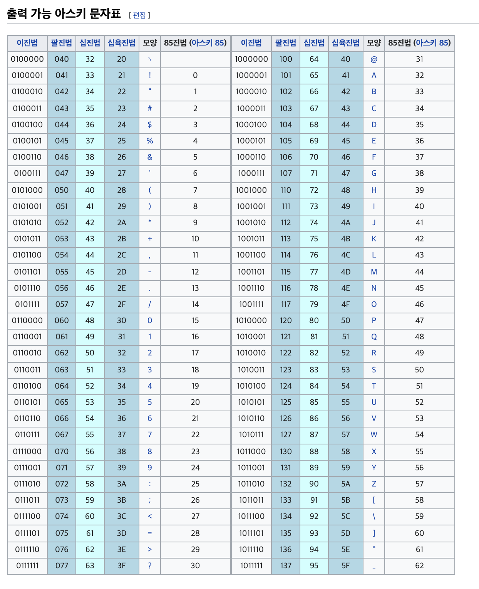

# 1장 네트워크 첫걸음

## 1.1 네트워크 구조

 

### <b>컴퓨터 네트워크</b>

 
네트워크 === 연결 
두 대 이상의 컴퓨터가 연결되어 있다면 바로 그것이 컴퓨터 네트워크.
 
네트워트를 통해 우리는 데이터 전송, 웹 사이트 열람, 이메일 송수신을 수행함.
 
 
인터넷 === 전 세계의 컴퓨터 네트워크를 연결하는 거대한 네트워크  
 

인터넷 더 알아보기

인터넷이란 프로토콜 스위트(TCP/IP)를 기반으로 전 세계에 연결되어 있는 컴퓨터 네트워크 통신망으로
www, 메일, 파일공유, 스트리밍등의 서비스를 포함한다.  

인터넷의 조상은 미국 국방부의 모든 정보를 저장하는 컴퓨터가 핵에 맞는다면 어떻게 될까 라는 생각에서 시작한다. 미 국방부는 서버를 분산배치 하고 그것들을 연결하는 방식으로 해결했다. 기존 방식보다 안정적인 패킷 방식을 채택했고 이때 최초로 패킷 스위칭 네트워크인 arpanet이 탄생한다.

www는 이 인터넷이라는 네트워크에 연결된 컴퓨터를 이용해 사람들과 정보를 공유할 수 있는 공간이다.
cern의 팀 버너스리경이 문서,동영상을 망라하는 DB를 구축하고 이를 전문 열람 SW로 보는 방식을 고안해낸곳에서 시작

  

\* <b>인터넷 프로토콜 스위트</b>는 인터넷에서 컴퓨터들이 정보를 주고받는데 쓰이는 통신규약 모음인데, 그들 중 제일 많이 쓰이는것이 TCP/IP이고, 그때문에 TCP/IP 프로토콜 스위트라고도 불림
  

### <b>패킷</b>  

네트워크(인터넷 포함)에서 데이터를 주고 받을땐 규칙이 있는데, 그 규칙은 패킷을 사용한다 !

패킷은 데이터를 주고받을때 전송되는 데이터의 작은 조각

그럼 왜 작은 조각으로 나눌까?  
또 소형차만 지나갈 수 있는 길에 대형 트럭이 지나가게 되면 교통이 정체되는 원리!
(물이 졸졸 나올수 있는 호수에 큰 얼음이 끼어버리는 형국인것 같다.) 큰 데이터라면 네트워크의 대역폭을 많이 차지해서 다른 패킷의 흐름을 막을수 있다

\* **대역폭**: 네트워크에서 제일 빠른 속도로 정보를 전송할 수 있는 단위시간당 전송량

패킷 === 작은 조각으로 나뉜 데이터

목적지에 패킷이 도착하면 패킷을 조합해 데이터로 되돌리는 작업이 필요하다.
이때 패킷이 순서대로 도착하지 않을 수도 있고, 누락이 될 수도 있어서 패킷에 번호를 붙여 원래의 데이터로 돌아갈 수 있도록 한다.
 
 

## 1.2 정보의 양 나타내는 단위

 

컴퓨터는 트랜지스터로 구성되어있고  
트랜지스터는 0 과 1만 나타낼 수 있다.

그럼 어떻게 사진이나 동영상 문자 숫자를 표현하는걸까 ?

문자를 예시로 들면, 아스키 코드가 있다.

미리 미리 이미지와 같이 숫자-문자 약속을 해놔서 키보드의 A 키를 누르면 컴퓨터는 이게 65이구나 이게 10000001이구나 알고 모니터에 A가 잘 나오는것!

\- 출처 위키피디아

자세히

초창기 컴퓨터 세계에는 약속된 체계가 없이 다양한 방법으로 문자를 표현했다.  
-> 호환성 문제 발생  
-> 미국에서 표준을 만듬 (ascii) (8비트)  
-> 알파벳을 제외한 다른 나라 언어 표현 못함  
-> 유니코드 탄생 (16비트)  
-> 1바이트만 있어도 되는데 2바이트를 써서 낭비..?  
-> UTF (unicode transformation format) utf-8 utf-16 등이 있음.  
유니코드를 갖고 다르게 표현하는 방식.

한글을 나타낼땐 크게 euc-kr과 utf-8을 많이 쓴다. 둘은 사용하는 코드표가 아예 다르다.
추천 검색어 : 유니코드, utf, euc-kr

 

## 1.3 랜과 왠

local area network  
근거리 통신망이 랜이다.
빌딩이나 집 같이 장소가 정해진 곳에서 컴퓨터, 프린터 등을 연결할 수 있는 네트워크  
좁은 구역에서 연결되어 있는 구조로 현재는 이더넷(TCP/IP)을 사용하는것이 일반적

wide area network
넓은 범위의 네트워크. 광역 통신망
인터넷 서비스 제공자(ISP, kt,u+,skb)가 제공하는 서비스를 활용해 구축된 네트워크  
랜과 랜의 연결
  

## 1.4 집에서의 랜

집에서 네트워크를 구축하려면 일단, ISP로 부터 인터넷을 개통해야한다.
공유기를 통해서 wan과 lan를 연결시켜 준다.
공유기를 중심으로 내부 인터넷망을 구성하고 다양한 기기를 연결한다.
  

## 1.5 회사에서의 랜

DMZ (demilitarized zone)  
외부에 공개하기 위한 네트워크
외부에 주로 웹서버, 메일서버, DNS 서버를 공개한다.
공개를 통해 외부인이 웹페이지에 접속하고, 메일을 보내고, 우리 도메인 이름을 사용해 서버에 접속한다.
회사에서는 이런 외부망 용도, 내부망 용도로 서버를 구축한다.

서버를 사내에 두는 온프레미스 방식도 있지만, 클라우드를 이용할수도 있다.
