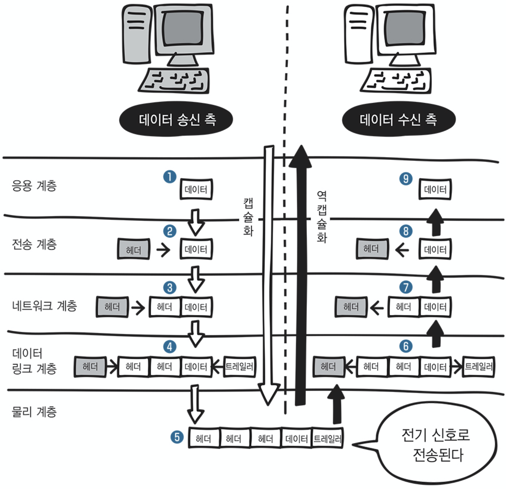

# 2장 네트워크의 기본 규칙

프로토콜 , OSI모델과 TCP/IP 모델, 캡슐화

## 프로토콜

일상에는 수많은 규칙이 있다.  
편지를 붙일 때 우표를 붙여야 한다는 규칙, 주소를 써야 한다는 규칙  
데이터들이 움직일 때에도 규칙이 필요하다.  
이게 바로 프로토콜!
컴퓨터 간 월활한 통신을 위해 지키기로 약속한 규칙.

## OSI모델, TCP/IP 모델

먼 옛날에는 같은 회사의 컴퓨터 끼리만 통신이 가능한 시절이 있었다.
케이블을 연결하는 커넥터도 회사별로 다르다면 매우 곤란 . .  
-> 표준 규격이 필요하다.

### OSI 7계층

ISO(국제 표준화기구)에서 정한 OSI모델

| 계층  | 이름             | 설명                                                  |
| ----- | ---------------- | ----------------------------------------------------- |
| 7계층 | 응용 계층        | 웹페이지 조회나 이메일 전송 등 서비스 제공            |
| 6계층 | 표현 계층        | 압축이나 암호화등의 데이터 변환                       |
| 5계층 | 세션 계층        | 세션이 체결된다. 통신방식 결정                        |
| 4계층 | 전송 계층        | 신뢰할 수 있는 통신 구현                              |
| 3계층 | 네트워크 계층    | 논리 주소 결정. 다른 네트워트와 통신을 위한 경로 설정 |
| 2계층 | 데이터 링크 계층 | 데이터 전송 및 물리주소 결정                          |
| 1계층 | 물리 계층        | 물리적 연결, 전기신호 변환과 제어                     |

(물데네전 세표응으로 외우면 잘외워진다~~~!)  
데이터를 보낼 떈 7계층부터 1계층으로, 받을땐 1계층에서 7계층으로.

### TCP/IP 4계층

| 계층  | 이름               | OSI              |
| ----- | ------------------ | ---------------- |
| 4계층 | 응용 계층          | 세션,표현,응용   |
| 3계층 | 전송 계층          | 전송             |
| 2계층 | 인터넷 계층        | 네트워크         |
| 1계층 | 네트워크 접속 계층 | 물리, 데이터링크 |

OSI 7계층을 4계층으로 바꾸면 이해하기 쉽다.  
각 계층마다 다양한 프로토콜이 존재한다.

## 캡슐화와 역캡슐화

데이터를 보내고 받을때는 캡슐화, 역캡슐화가 일어난다.

데이터를 보낼 때 앞부분에 헤더를 붙여서 다음 계층으로 보낸다. 이것이 캡슐화.  
(헤더에는 데이터를 전달받을 상대에 대한 정보, 현재 계층의 특성을 담은 제어 정보를 담고 있다.)

데이터링크 계층에서는 트레일러도 붙인다.

캡슐화의 반대로, 데이터를 받을때 헤더를 벗기는것이 역캡슐화이다.
