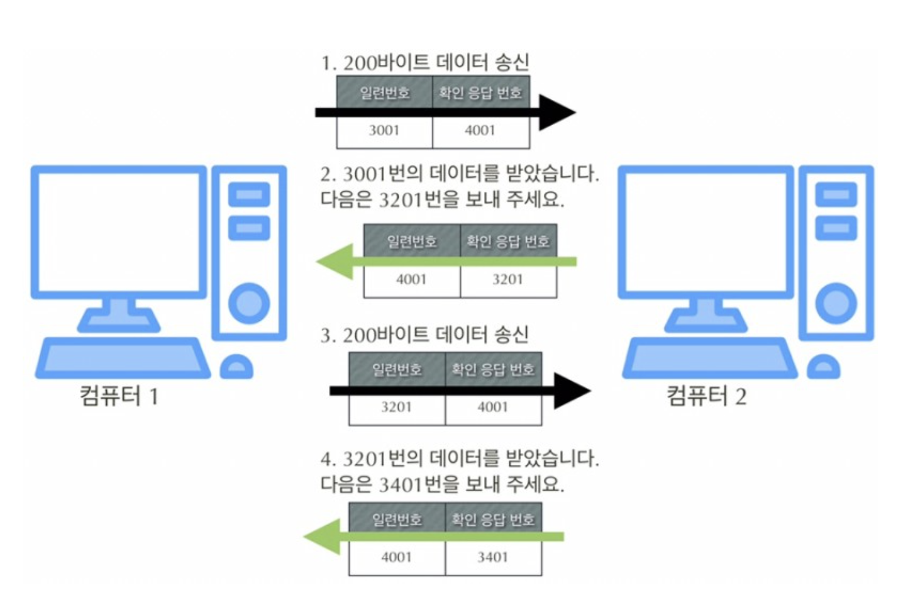

# 6장. 전송계층: 신뢰가능 데이터 전송

## 전송계층이 필요한 이유

기존의 물리계층, 데이터링크계층, 네트워크계층만 있어도 데이터를 송수신하는 것이 가능하지만 앞의 3계층에서는 데이터의 손상 혹은 유실에 대해서 책임져 주지 않는다. 따라서 `목적지까지 신뢰할 수 있는 데이터를 전달`하기 위해서 전송계층이 필요하다.

 

### 전송계층의 기능

- 오류점검기능
- 어떤 어플리케이션에서 사용하는지 식별기능

 

## 연결형 통신과 비연결형 통신

- 연결형통신 ⇒ 정확성,신뢰성 추구 TCP 안정성, 유실가능성 낮음, 일반
- 비연결형통신 ⇒ 효율성 추구 UDP 빠른전송, 유실가능성 높음, 동영상

 

## TCP(Transmition Control Protocol)

연결형통신으로서 정확성과 신뢰성을 추구하는 프로토콜이다. TCP를 사용하기 위해서는 전송계층에서 `TCP헤더`를 붙여 캡슐화 시켜야하는데 TCP헤더가 붙은 데이터를 `세그먼트`라고 한다.

 

### 연결(connection)

연결형 통신을 하려면 연결이라는 가상의 독점 통신로를 확보해야 한다. TCP헤더를 살펴보면 `코드비트 영역`(107~112번째 비트)이 존재하는데 여기서 SYN, ACK 항목이 연결 확립에 사용된다. 초기값은 0이고, 활성화 될 경우 1이된다. `SYN은 연결요청`, `ACK는 확인응답`을 의미한다.

 

### 3-way 핸드셰이크

**TCP에서** 신뢰할 수 있는 연결을 확보하기 위해 사용하는 패킷교환이다. 아래와 같이 3회에 걸쳐 진행된다.

1. A ⇒ SYN=1 ⇒ B
2. B ⇒ SYN=1 + ACK=1 ⇒ A
3. A ⇒ ACK=1 ⇒ B

- 연결 완료!

반면 연결을 종료할 때는 4단계에 걸쳐 이뤄진다.

1. A ⇒ FIN=1 ⇒ B
2. B ⇒ ACK=1 ⇒ A
3. B ⇒ FIN=1 ⇒ A
4. A ⇒ ACK=1 ⇒ B

- 연결 종료!

 

### 일련번호와 확인 응답 번호

TCP는 데이터를 분할해서 보내는데, 수신자가 받은 데이터가 몇 번째 데이터인지 정보를 알려주기 위해서 송신자가 보내는 것이 `일련번호`이다. 반면 `확인응답번호`는 수신하는 쪽에서 몇 번째 데이터까지 받았는지 송신자에게 알려주기 위해 사용한다. 확인응답번호는 다음 데이터를 요청할 때도 사용된다.

이러한 과정을 거쳐도 데이터가 항상 정확하게 전달되지 않을 수 있는데 이처럼 데이터가 손상되거나 유실된 경우 재전송을 요청한다. 이를 `재전송 제어`라고 부른다.

 

### 윈도우크기(window size)

TCP통신시 일련번호를 순차적으로 전송하면 시간이 오래걸린다. 따라서 실제로는 데이터를 보낼 때 반환을 기다리지 않고 연속해서 송신한다. 이때 수신하는 측에서 처리되지 않은 데이터를 저장하는 공간이 존재하는데 이를 `버퍼`라고 한다. 버퍼도 용량이 한정되어있기 때문에 너무 많은 데이터를 받아서 더이상 저장되지 않는 현사을 `오버플로우`라고 한다. 그래서 오버플로우가 발생하지 않게하기 위해 송신하는 측에서 상대방의 버퍼크기를 알고 있어야하는데 이를 TCP헤더의 `윈도우크기(window size)`값에 저장한다. 윈도우 크기는 얼마나 많은 용량의 데이터를 저장해 둘 수 있는지를 나타내며, 이는 3-way 핸드셰이크 과정에서 파악한다.

 

### 포트번호

전송계층에서는 주고 받는 데이터가 어떤 어플리케이션에서 사용되는지 식별할 필요가 있는데 이를 가능하게 해주는 것이 `포트번호`이다. 포트번호는 TCP헤더의 출발지 포트번호(16비트)와 목적지 포트번호(16비트)에 저장하여 사용한다. 포트번호는 다음과 같이 구분하여 사용된다.

- 0~1023: 잘 알려진 포트(well-known port)
- 1024: 예약은 되어있지만 사용하지 않음
- 1025~65535(2의 16승): 랜덤포트

잘 알려진 포트 중 대표적인 어플리케이션

- SSH(22): 시큐어쉘. 원격명령 실행, 깃헙에서 레포관리시 사용됨
- SMTP(25): 간이우편전송. 이메일 보낼 때
- DNS(53): 도메인이름을 네트워크ID(5장참조)로 변경
- HTTP(80): HTML을 주고 받을시
- POP3(110): 이메일을 받아올 때
- HTTPS(443): HTTP의 보안강화버전

 

## UDP(User Datagram Protocol)

UDP는 비연결형 통신으로서 컴퓨터간 동영상, 스트리밍, 실시간 데이터통신 등 효율성을 추구하는 데 사용되는 프로토콜이다. UDP는 비연결형 통신이어서 TCP의 3-way 핸드셰이크 같은 신뢰성 기능이 없다. 하지만 프로토콜을 사용하는 프로그래머가 신뢰성 기능을 직접 짜서 신뢰성을 부여할 수는 있다고 한다.

UDP에서는 `UDP헤더`가 데이터 앞에 붙으며 UDP헤더가 붙은 데이터를 `UDP 데이터그램`이라고 부른다. UDP는 상대방을 확인하지 않고 연속해서 데이터를 보낸다. UDP를 사용하면 컴퓨터나 네트워크 장비에 데이터를 일괄적으로 보낼 수 있는데 이를 `브로드캐스트`라고 한다.
